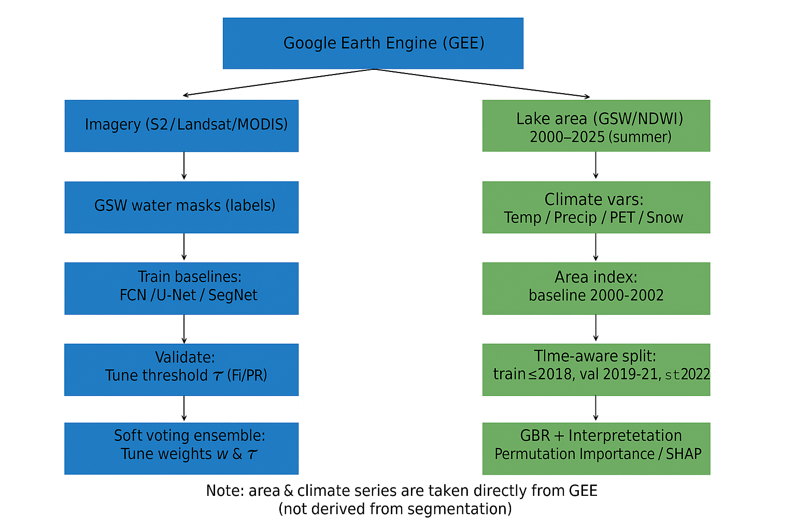
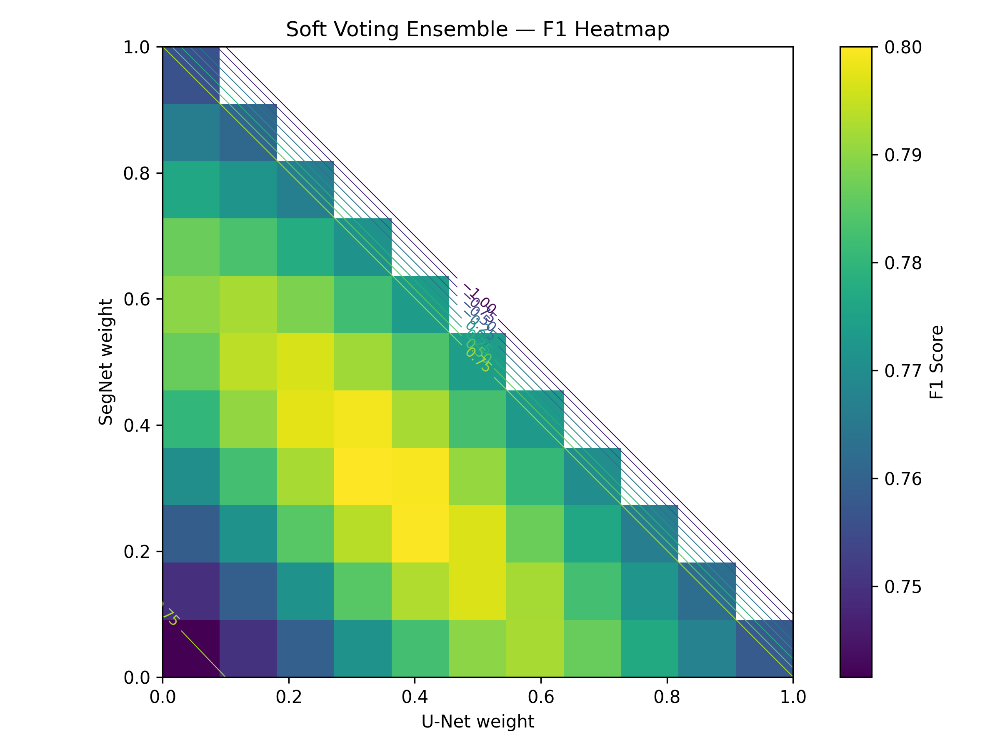
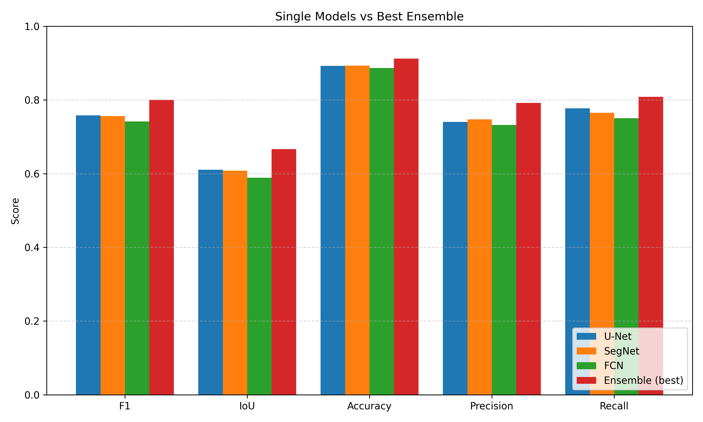
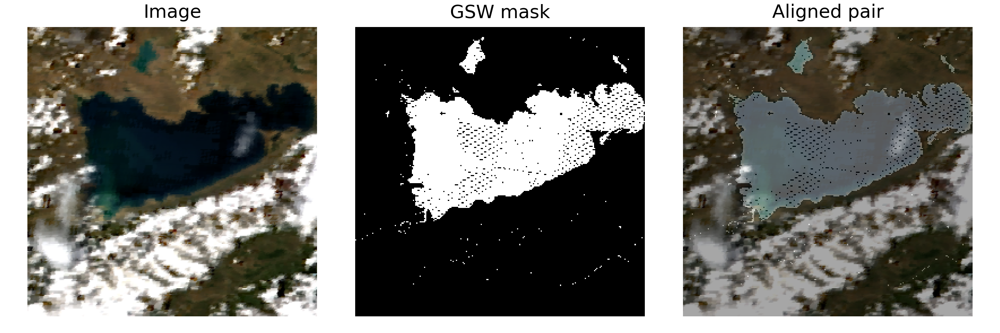
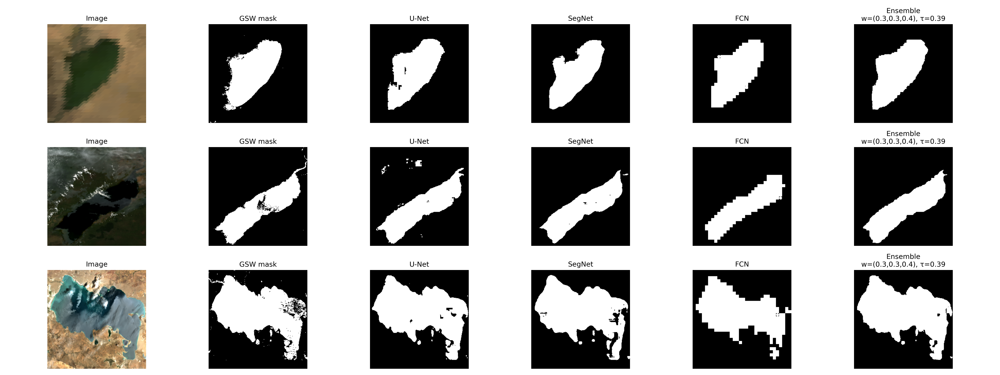
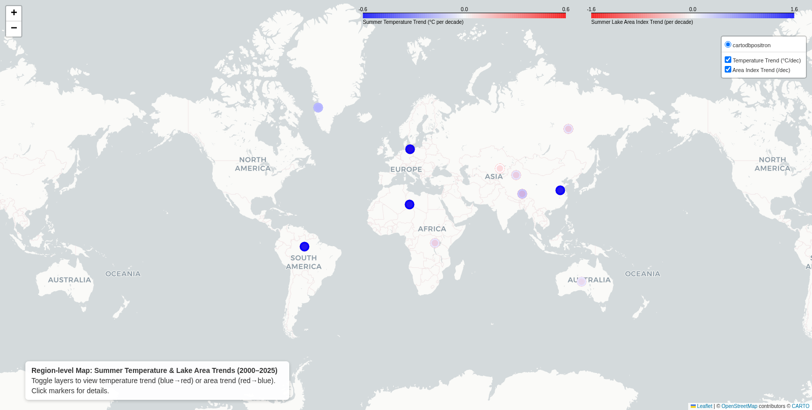
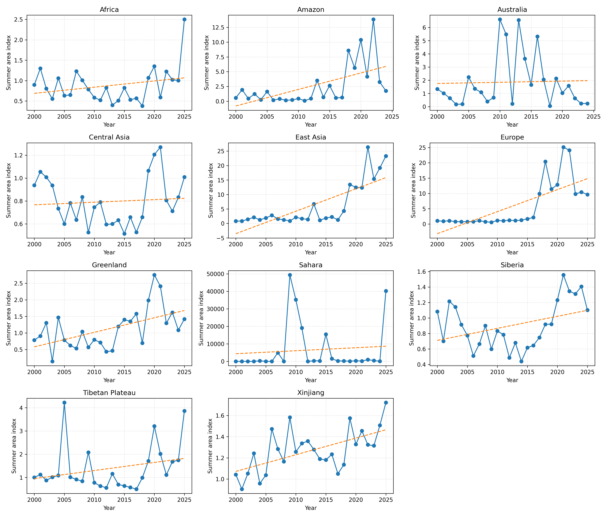
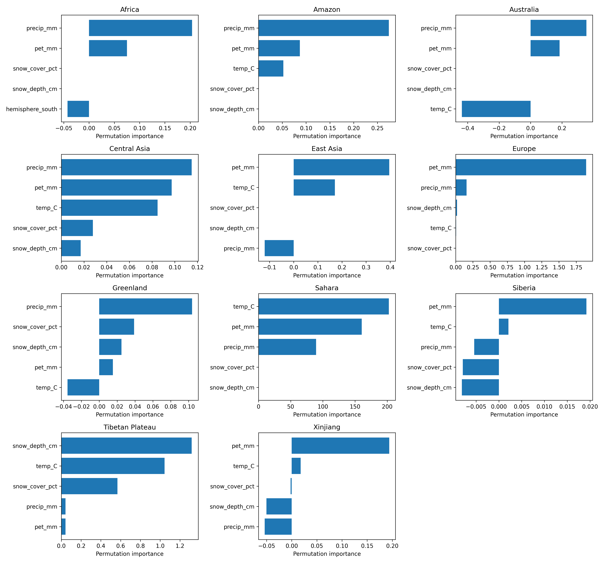
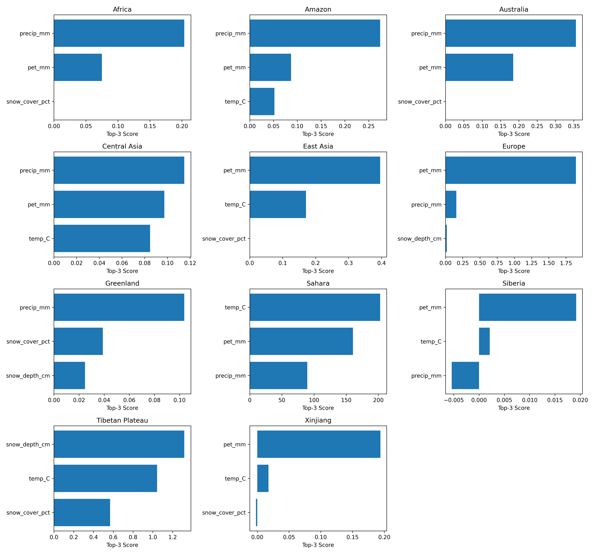

# 🌍 Lake Change Analysis with Remote Sensing & Deep Learning

This project investigates **lake dynamics from 2000–2025** through a combination of remote sensing, deep learning, and climate data analysis. The workflow integrates the following components:  
- Acquisition of multi-source remote sensing imagery (Sentinel-2, Landsat, MODIS) from **Google Earth Engine (GEE)**, combined with the **JRC Global Surface Water (GSW)** mask.  
- Extraction of **lake area and climate variables** (temperature, precipitation, evapotranspiration, and snow cover).  
- Application of **deep learning segmentation models (U-Net, SegNet, FCN)** for lake boundary detection.  
- Integration of **machine learning and explainable AI techniques (GBR, SHAP, PDP)** to quantify the relationship between climate drivers and lake changes.  
- Generation of **trend maps and publication-ready figures** summarizing global and regional patterns.  

---

## 📂 Repository Structure

```
Lake-Change-Analysis/
│
├── gee_scripts/                           # Python scripts for bulk downloading imagery and masks
│ ├── check_the_lake_region.py             # Visualization and compositing for individual lakes
│ ├── choose_one_each_month.py             # Automated monthly best-image selection
│ ├── download_gsw_mask.py                 # Exporting GSW-based water masks
│ └── download_lake_dataset.py             # Bulk download of lake imagery datasets
│
├── gee_scripts/earthengine/               # JavaScript scripts for GEE Code Editor
│ ├── lake_area.js                         # Lake area (2000–2025) using Sentinel-2 (primary) and Landsat (fallback) and GSW(fallback)
│ └── lake_climate.js                      # ERA5 summer climate variables with standardized units
│
├── training/                              # Model training and evaluation
│ ├── train_all.py                         # Training of U-Net, SegNet, and FCN models
│ └── evaluate_lake.py                     # Model evaluation and Soft Voting ensemble
│
├── analysis/                              # Post-processing and climate–lake analysis
│ ├── analysis_with_ai.py                  # Gradient Boosting + SHAP/PDP interpretability analysis
│ └── check_data.py                        # Data integrity verification
│
├── viz/                                   # Visualization scripts
│ ├── map.py                               # Interactive map visualization (Folium)
│ └── plot.py                              # Automated generation of publication figures
│
├── dataset/                               # Local/remote storage of raw data and models (excluded from GitHub)
│ ├── image/                               # Original remote sensing imagery
│ ├── mask/                                # GSW water masks
│ └── models/                              # Trained model weights
│
├── results/                               # Evaluation results and derived datasets
│ ├── ensemble_heatmap.png
│ ├── model_vs_ensemble.png
│ ├── method_pipeline.png
│ ├── grid_search_ensemble_results.csv
│ │
│ ├── lake_climate/                        # Results of lake–climate relationship analysis
│ │ ├── Lake_Area_and_Climate_2000_2025.csv
│ │ ├── Regional-Decade_Trend_Temperature_Area.csv
│ │ ├── GBR_Regional_Performance_(Summer).csv
│ │ ├── Permutation_Importance_(By_Region,Summer).csv
│ │ ├── Top_3_Important_Features_by_Region(Summer).csv
│ │ └── Feature_Directional_Index.csv
│ ├── figures/                             # Static publication figures
│ │ ├── Fig2_sample_triptych.png
│ │ ├── Fig3_qualitative_comparison.png
│ │ ├── Fig6_global_trends.png
│ │ ├── Fig7_region_trends.png
│ │ ├── Fig8_region_small_multiples.png
│ │ ├── Fig9_top3_features.png
│ │ └── Fig9_permutation_importance.png
│ └── maps/                                # Interactive map outputs (HTML)
│ ├── region_trends_map.html
│ ├── global_heatmap_lakes_trends.html
│ └── lake_area_trend_with_climate.html
├── README.md
└── .gitignore
```

---

## ⚙️ Installation

```bash
git clone https://github.com/<your-username>/Lake-change-analysis.git
cd Lake-change-analysis
pip install -r requirements.txt
```

- Requires Python ≥ 3.9.  
- Major dependencies include: earthengine-api, geemap, tensorflow, scikit-learn, shap, folium, matplotlib.

---

## 📥 Data Acquisition

Due to the large size of the datasets (>100MB), they are not included in the repository. They can be retrieved from external storage and placed into the dataset/ directory:

Raw imagery → dataset/image/

GSW masks → dataset/mask/

Pre-trained model weights → dataset/models/

Expected structure:
```
dataset/
├── imsge/
├── mask/
└── models/
```

---

## 🛰️ Exporting Lake Area and Climate Data via GEE

The following scripts are executed within the Google Earth Engine Code Editor
:

lake_area.js → Lake area estimation with Sentinel-2 priority and Landsat fallback and GSW fallback (2000–2025).

lake_climate.js → Summer climate variables (temperature, precipitation, evapotranspiration, snow cover) with harmonized units.

Upon execution, results can be exported as CSV files via the Tasks panel in GEE, and downloaded to Result/lake_climate/100Lake_area_Temperature_2000-2025.csv.
---

## 🧠 Model Training and Evaluation

### 1. Training
```bash
python training/train_all.py
```
Performs automated dataset partitioning.
Trains U-Net, SegNet, and FCN segmentation models.
Saves trained models and performance metrics. 

### 2. Evaluation and Ensemble
```bash
python training/evaluate_lake.py
```
Computes segmentation metrics (IoU, Dice, F1, Precision, Recall).
Performs grid search for optimal Soft Voting ensemble weights.
Produces ensemble heatmaps and comparison figures. 

---

## 📊 Data Analysis and Visualization

### 1. Data Validation
```bash
python analysis/check_data.py
```
Produces a data integrity report, highlighting missing or anomalous years.

### 2. Climate–Lake Relationship Analysis
```bash
python analysis/analysis_with_ai.py
```
Trains Gradient Boosting Regression models.
Conducts SHAP and PDP analysis for feature interpretability.
Exports results into structured Excel/CSV reports.  

### 3. Visualization
```bash
python viz/map.py
python viz/plot.py
```
Generates interactive maps (Folium).
Produces figures for publication (e.g., Fig2, Fig3, Fig6–9).

---

## 📈 Model Evaluation Results

### Workflow


### Ensemble Performance
- **F1 Score Heatmap (Soft Voting weight search):**
  

- **Model vs Ensemble Comparison:**  
  

### For detailed numerical outputs,
see [grid_search_ensemble_results.csv](results/grid_search_ensemble_results.csv)

## 🌡️ Lake–Climate Analysis Results

### Time Series
- [Lake_Area_and_Climate_2000_2025.csv](results/lake_climate/Lake_Area_and_Climate_2000_2025.csv)  
  Summer lake area and climate time series for 100 lakes (2000–2025).

### Regional Trends
- [Regional-Decade_Trend_Temperature_Area.csv](results/lake_climate/Regional-Decade_Trend_Temperature_Area.csv)  
  Decadal-scale regional trends in temperature and lake area.

### Model Performance
- [GBR_Regional_Performance_(Summer).csv](results/lake_climate/GBR_Regional_Performance_(Summer).csv)  
  Regional-level performance of GBR models.

### Feature Importance
- [Permutation_Importance_(By_Region,_Summer).csv](results/lake_climate/Permutation_Importance_(By_Region,_Summer).csv)  
  Climate variable importance by region. 
- [Top_3_Important_Features_by_Region_(Summer).csv](results/lake_climate/Top_3_Important_Features_by_Region_(Summer).csv)  
  Top three climate variables per region. 
- [Feature_Directional_Index.csv](results/lake_climate/Feature_Directional_Index.csv)  
  Directionality of feature effects (correlation, SHAP, PDP slope).

## 🖼️ Visualization Outputs for Publication

### Data and Mask Example
- 

### Model Comparison (Qualitative)
- 

### Global and Regional Trends
-   
-   
- 

### Feature Importance
- 
- 

### Interactive Maps
- [ (region_trends_map.html)](results/maps/region_trends_map.html)
- [ (global_heatmap_lakes_trends.html)](results/maps/global_heatmap_lakes_trends.html)
- [ (lake_area_trend_with_climate.html)](results/maps/lake_area_trend_with_climate.html)


---

